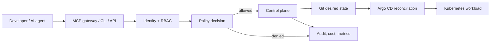

# AI Platform Control Plane

A governed internal developer platform that lets engineers and AI agents request environments through a policy-enforced API—without receiving AWS administrator credentials.

It is deliberately a **control plane**, not an AI demo app. A request is authenticated, authorized, policy-checked, planned with a cost estimate, persisted as an auditable lifecycle, rendered to GitOps desired state, and then reconciled by Kubernetes tooling.



## What works now

- FastAPI `/api/v1` control plane with tenant boundaries, lifecycle transitions, idempotency keys, plans, audit events, approval workflow, safe dev destruction, and Prometheus metrics.
- SQLite-backed local lifecycle and audit state survives a control-plane restart; it is covered by a restart-recovery test.
- Golden-path desired-state generation for a Kubernetes service environment.
- Policy boundary that fails closed: agents cannot create production, privileged workloads are prohibited, observability cannot be disabled, and production requires an operator approval.
- Runnable local tests and demo. Local mode renders GitOps configuration; it does **not** claim to provision AWS or reconcile a real cluster.

See [implementation status](docs/IMPLEMENTATION_STATUS.md) and [project status](PROJECT_STATUS.md) for the evidence boundary and current P0 work.

## Quick start

Requires Python 3.12+.

```console
git clone https://github.com/bepoadewale/ai-platform-control-plane.git
cd ai-platform-control-plane
make install
make test
make demo
make run
```

Open `http://127.0.0.1:8000/docs` for the API. In local development, identity comes from request headers only; replace this with OIDC workload/user tokens before deployment.

```console
curl -X POST http://127.0.0.1:8000/api/v1/environments \
  -H 'content-type: application/json' \
  -H 'x-platform-subject: demo-agent' \
  -H 'x-platform-tenant: team-demo' \
  -H 'x-platform-roles: agent-requester' -H 'x-platform-agent: true' \
  -d '{"name":"demo-api","team":"team-demo","environment_type":"development","ttl_hours":12,"postgresql":true,"redis":true,"cost_center":"DEMO","idempotency_key":"demo-agent-001"}'
```

## Technology choices

FastAPI/Pydantic provide the typed infrastructure API. Kubernetes Helm templates establish workload defaults. Argo CD is the reconciler for Git desired state. OPA/Rego policy is supplied as the deployable policy contract, while the local adapter keeps the initial workflow runnable without a policy server. Terraform modules are opt-in AWS infrastructure foundations. Prometheus/OpenTelemetry configuration provides control-plane observability.

See [architecture](docs/architecture.md), [local development](docs/local-development.md), [demo](docs/demo.md), [agent safety](docs/agent-safety.md), [failure modes](docs/failure-modes.md), and the [interview guide](docs/interview-guide.md). To capture portfolio screenshots, run the demo/API then capture `/docs`, `/metrics`, `kubectl get all -n team-demo-demo-api`, and the Grafana dashboard after Prometheus is installed.

## Production boundary

This portfolio implementation is locally runnable, not production-certified. Production needs durable PostgreSQL persistence, OIDC/JWKS validation, an OPA sidecar/bundle, Git commit signing and protected branches, Argo CD HA, external secrets, managed database operators, and a real job/reconciliation queue. AWS is intentionally opt-in; no expensive resources or GPUs are created by default.

Next: run `make test`, then follow [the local setup](docs/local-development.md) or review the [roadmap](ROADMAP.md).
