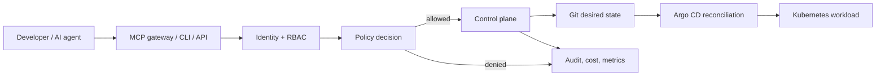

# AI Platform Control Plane

A governed internal developer platform that lets engineers and AI agents request environments through a policy-enforced API—without receiving AWS administrator credentials.

It is deliberately a **control plane**, not an AI demo app. A request is authenticated, authorized, policy-checked, planned with a cost estimate, persisted as an auditable lifecycle, rendered to GitOps desired state, and then reconciled by Kubernetes tooling.

## What this repository demonstrates

It turns an infrastructure request into a governed lifecycle instead of handing a person or an AI
agent unrestricted cloud, Kubernetes, Terraform, or Git credentials.

```text
request → signed identity → tenant/RBAC → OPA policy → immutable plan
        → approval where required → desired state → reconciliation → readiness → audit
```

The platform is intentionally opinionated: a caller selects an approved environment shape and a few
business inputs (name, team, environment class, TTL, data services, cost centre). The platform owns
the Kubernetes details: namespace, service account, quotas, limits, probes, non-root settings,
network policy, desired-state rendering, readiness observation, and cleanup.

### Who can do what

| Caller | Allowed locally | Explicitly not allowed |
| --- | --- | --- |
| Viewer | Read catalog, environment status, audit and estimated cost for its tenant | Create, approve, or destroy environments |
| Developer | Plan and request tenant-scoped development environments; request production changes | Read or mutate another tenant; self-approve protected production changes; receive cluster/cloud admin credentials |
| Platform operator | Review and independently approve an exact protected plan | Approve a materially changed/stale plan; bypass tenant or policy checks |
| AI agent (`agent-requester`) | Discover platform capabilities, estimate cost, plan approved work, and request permitted tenant-scoped environments through MCP/API | Grant itself approval; make autonomous protected-production changes; execute arbitrary Terraform, `kubectl`, or obtain AWS/Kubernetes credentials |

The API remains the enforcement point for every path—HTTP, CLI, and MCP tools. An MCP tool does
not receive a side door around identity, OPA, approval, idempotency, audit, or reconciliation.

### Real scenarios to discuss or run

1. **Developer creates a short-lived development environment.** A signed developer identity requests
   `demo-api`; OPA permits it, the API creates a plan, Helm reconciles into kind, the API observes
   the Deployment as Ready, and the audit timeline records each transition. Destruction verifies the
   namespace is gone.
2. **AI agent requests a production environment.** OPA rejects autonomous production mutation before
   any Kubernetes resource is created. The denial is auditable; the agent cannot approve itself.
3. **Developer requests production.** The request becomes `APPROVAL_REQUIRED`. A different platform
   operator approves the exact plan hash, after which reconciliation may proceed. A changed or stale
   plan invalidates that approval.
4. **A workload cannot become healthy.** The reconciler times out, persists `FAILED`, emits a
   `reconciliation.failed` audit event, and never falsely reports `READY`.
5. **A temporary environment expires.** The TTL reaper plans and verifies cleanup; protected
   production environments are not silently TTL-deleted.

Each scenario above has executed local evidence; see [demo scenarios](docs/demo.md),
[security model](docs/security.md), and [agent safety](docs/agent-safety.md).



## What works now

- FastAPI `/api/v1` control plane with tenant boundaries, lifecycle transitions, idempotency keys, plans, audit events, approval workflow, safe dev destruction, and Prometheus metrics.
- SQLite-backed local lifecycle and audit state survives a control-plane restart; it is covered by a restart-recovery test.
- RS256 JWT/JWKS bearer-token validation is exercised through the API; development headers require an explicit insecure opt-in.
- A local OPA container evaluates live Rego decisions and fails closed when unavailable. The live path has denied an autonomous production-agent request.
- Golden-path desired state is reconciled into a local kind cluster with Helm. The API waits for Deployment readiness and API destroy verifies resource cleanup.
- The same chart is reconciled by local Argo CD; the Application reaches `Synced/Healthy` and its
  managed Deployment reaches `1/1` available replicas.

## What this repository deliberately does not do

- It does not create AWS/EKS infrastructure, incur cloud spend, or claim production HA validation.
- It does not expose raw Kubernetes credentials, Docker sockets, Terraform execution, long-lived
  cloud credentials, or secret values to callers or agents.
- It does not treat a rendered Helm chart, a Terraform module, or a mocked unit test as proof of a
  deployment. The implementation-status table separates local execution from static-only adapters.
- It does not let availability silently override policy: an unavailable policy decision fails closed
  for protected writes; protected destruction and production changes require independent approval.

See [implementation status](docs/IMPLEMENTATION_STATUS.md) and [project status](PROJECT_STATUS.md) for the evidence boundary and current maturity.

## Quick start

Requires Python 3.12+.

```console
git clone https://github.com/bepoadewale/ai-platform-control-plane.git
cd ai-platform-control-plane
make install
make test
make demo
make run
```

For the complete local integration demo (Docker Desktop, kind, kubectl, and Helm required):

```console
make bootstrap-local
make compose-smoke
make demo-local
make argocd-demo
```

This bootstraps kind, Metrics Server, and Argo CD; validates the Keycloak/PostgreSQL/OTel/Prometheus/Grafana Compose stack; and proves signed identity → OPA → FastAPI → kind readiness → audit/metrics → destroy, autonomous production-agent denial, production apply/destroy with an independent operator approving exact plan hashes, and Argo CD `Synced/Healthy`. No cloud credentials are used.

Open `http://127.0.0.1:8000/docs` for the API. Bearer JWT validation is the default. Header identity is a development-only escape hatch and requires both `PLATFORM_AUTH_MODE=headers` and `PLATFORM_ALLOW_INSECURE_HEADERS=true`.

```console
PLATFORM_AUTH_MODE=headers PLATFORM_ALLOW_INSECURE_HEADERS=true make run

curl -X POST http://127.0.0.1:8000/api/v1/environments \
  -H 'content-type: application/json' \
  -H 'x-platform-subject: demo-agent' \
  -H 'x-platform-tenant: team-demo' \
  -H 'x-platform-roles: agent-requester' -H 'x-platform-agent: true' \
  -d '{"name":"demo-api","team":"team-demo","environment_type":"development","ttl_hours":12,"postgresql":true,"redis":true,"cost_center":"DEMO","idempotency_key":"demo-agent-001"}'
```

## Execution boundary

The verified local kind/OPA demo uses signed, temporary RS256 JWT/JWKS material through FastAPI. The Compose stack executes synthetic Keycloak OIDC, PostgreSQL-backed API persistence, OTLP export, Prometheus scraping, and a provisioned Grafana dashboard through `make compose-smoke`. `make argocd-demo` synchronizes the golden path with local Argo CD and waits for `Synced/Healthy`. The curl example above is explicitly development-only. AWS/EKS is not executed. See [implementation status](docs/IMPLEMENTATION_STATUS.md).

The local demo has also passed a clean-room reset: `make clean-local` removes only this repository's
Compose resources, local image, named volumes, and `ai-platform-local` kind cluster. Re-running the
documented bootstrap, smoke, lifecycle, and Argo commands recreated the stack and validated it;
`make clean-local` then returned the machine to a Project-1-clean state.

## Technology choices

FastAPI/Pydantic provide the typed infrastructure API. Kubernetes Helm templates establish workload defaults. The local direct reconciler and Argo CD GitOps synchronization are executed against kind. OPA/Rego is the live policy evaluator. Terraform modules are opt-in AWS infrastructure foundations. Prometheus metrics and OpenTelemetry spans are emitted through the local Compose stack.

See [architecture](docs/architecture.md), [local development](docs/local-development.md), [demo](docs/demo.md), [agent safety](docs/agent-safety.md), [failure modes](docs/failure-modes.md), and the [interview guide](docs/interview-guide.md). To capture portfolio screenshots, run the demo/API then capture `/docs`, `/metrics`, `kubectl get all -n team-demo-demo-api`, and the Grafana dashboard after Prometheus is installed.

## Production boundary

This portfolio implementation is locally runnable, not production-certified. Production needs durable PostgreSQL persistence, OIDC/JWKS validation, an OPA sidecar/bundle, Git commit signing and protected branches, Argo CD HA, external secrets, managed database operators, and a real job/reconciliation queue. AWS is intentionally opt-in; no expensive resources or GPUs are created by default.

Next: run `make test`, then follow [the local setup](docs/local-development.md) or review the [roadmap](ROADMAP.md).
