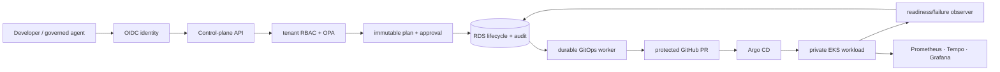

# AI Platform Control Plane

A cloud-first, governed control plane for humans and AI agents to request Kubernetes environments
without receiving AWS administrator, Kubernetes, Terraform, Git, or secret credentials.

**Delivery state:** **Production-pilot complete — ephemeral single-account scope.** The AWS
reference environment was created with Terraform, validated through real EKS GitOps workflows, and
destroyed with Terraform. It is not enterprise/public-SaaS certified.


```mermaid
flowchart LR
  C[Developer / governed agent] --> I[OIDC identity]
  I --> A[Control-plane API]
  A --> P[tenant RBAC + OPA]
  P --> L[immutable plan + approval]
  L --> D[(RDS lifecycle + audit)]
  D --> W[durable GitOps worker]
  W --> G[protected GitHub PR]
  G --> R[Argo CD]
  R --> K[private EKS workload]
  K --> O[readiness/failure observer]
  O --> D
  K --> T[Prometheus · Tempo · Grafana]
```

See the detailed [cloud architecture](docs/cloud-architecture.md), including AWS resources, trust
boundaries, and lifecycle sequence.

## What it allows—and prevents

| Caller | Allowed | Prevented |
| --- | --- | --- |
| Developer | Request tenant-scoped development environments and propose production changes | Cross-tenant access, direct cloud/cluster credentials, self-approval |
| Platform operator | Independently approve the exact protected plan | Approving stale/changed plans or bypassing policy |
| AI agent | Inspect catalog/audit, estimate cost, plan, and request permitted work through API/MCP | Self-approval, autonomous protected production mutation, arbitrary Terraform or `kubectl`, secret access |

Every write follows the same control loop:

```text
signed identity → tenant/RBAC → OPA → immutable plan → independent approval where required
→ durable GitOps job → protected GitHub PR → Argo CD → EKS readiness/failure
→ persistent audit, metrics, traces → governed destroy
```

The API owns intent and governance. Argo CD owns cloud reconciliation. The API does not shell out
to Helm, `kubectl`, or Terraform against EKS.

## Cloud reference evidence

The private AWS pilot executed:

- Terraform VPC, private EKS, RDS PostgreSQL, ECR, Secrets Manager, IAM/IRSA, GitHub OIDC and
  remote state guardrails.
- Keycloak-issued signed JWT, tenant/RBAC, live OPA denial, plans, independent approvals, durable
  PostgreSQL state, audit, and restart recovery.
- GitHub App desired-state PR → protected merge → Argo ApplicationSet → private workload `Ready`.
- Bad image → `ImagePullBackOff` / `ProgressDeadlineExceeded` → reviewed known-good restore →
  governed GitOps deletion and namespace prune.
- Two API/OPA/worker replicas with PDBs; deliberate API and worker Pod loss restored `2/2`.
- Prometheus, Tempo, Grafana, a firing alert, bounded authenticated load, and temporary
  Cloudflare-tunnel Console review.
- Account-guarded Terraform teardown with EKS, RDS, ECR, pilot secrets, pilot IAM roles, tagged
  VPCs, and remote workload state verified absent.

Exact evidence: [validation record](docs/VALIDATION.md) and
[implementation status](docs/IMPLEMENTATION_STATUS.md).

## Cloud operations

The pilot is intentionally not started by default. It creates billable resources only through
Terraform and only after plan review.

```console
AWS_PROFILE=<operator-profile> make pilot-cloud-plan
AWS_PROFILE=<operator-profile> make pilot-cloud-apply
AWS_PROFILE=<operator-profile> make pilot-cloud-bootstrap-runtime
AWS_PROFILE=<operator-profile> make pilot-cloud-smoke
```

Run the operational drills and destroy procedure in [Cloud Operations](docs/cloud-operations.md).
The destroy command is account-guarded and removes only project-owned pilot resources.

## Current boundary and next improvements

The completed pilot does **not** claim enterprise IdP validation, trusted public TLS ingress,
model-quality rollback, sustained error-budget evidence, disaster recovery, settled AWS billing, or
GitHub-hosted destroy execution. These are deliberate next production improvements, not hidden
gaps. See [Production Evolution](docs/production-evolution.md).

## Documentation

- [Cloud architecture](docs/cloud-architecture.md) · [Cloud operations](docs/cloud-operations.md)
- [Security model](docs/security.md) · [Agent safety](docs/agent-safety.md) · [GitOps](docs/gitops.md)
- [Operator Console](docs/operator-console.md) · [Observability](docs/observability.md)
- [Validation evidence](docs/VALIDATION.md) · [Implementation status](docs/IMPLEMENTATION_STATUS.md)
- [Production evolution](docs/production-evolution.md) · [Interview guide](docs/interview-guide.md)

## Developer harness

The original kind/Compose implementation remains available for fast contributor verification, but is
not the deployment story: see [local development](docs/local-development.md).
