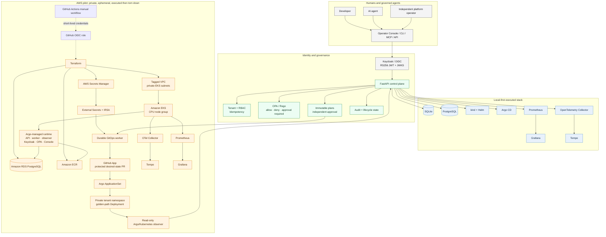

# AI Platform Control Plane


```mermaid
flowchart TB
  classDef local fill:#e8f1fb,stroke:#3b82c4,color:#102a43;
  classDef aws fill:#fff3e0,stroke:#d97706,color:#4a2900;
  classDef guard fill:#ecfdf3,stroke:#15803d,color:#123b24;
  classDef evidence fill:#f4f4f5,stroke:#52525b,color:#18181b;

  subgraph callers[Humans and governed agents]
    Dev[Developer] --> Entry[Operator Console / CLI / MCP / API]
    Agent[AI agent] --> Entry
    Operator[Independent platform operator] --> Entry
  end

  subgraph identity[Identity and governance]
    Keycloak[Keycloak / OIDC\nRS256 JWT + JWKS] --> API[FastAPI control plane]
    Entry --> Keycloak
    API --> RBAC[Tenant + RBAC\nIdempotency]
    API --> OPA[OPA / Rego\nallow · deny · approval required]
    API --> Plans[Immutable plans\nindependent approval]
    API --> Audit[Audit + lifecycle state]
  end

  subgraph local[Local-first executed stack]
    SQLite[(SQLite)]
    PostgresLocal[(PostgreSQL)]
    Kind[kind + Helm]
    ArgoLocal[Argo CD]
    OTelLocal[OpenTelemetry Collector]
    PromLocal[Prometheus] --> GrafanaLocal[Grafana]
    TempoLocal[Tempo]
  end

  API --> SQLite
  API --> PostgresLocal
  API --> Kind
  API --> ArgoLocal
  API --> OTelLocal --> TempoLocal
  API --> PromLocal

  subgraph cloud[AWS pilot: private, ephemeral, executed then torn down]
    Actions[GitHub Actions manual workflow] -. short-lived credentials .-> OIDC[GitHub OIDC role]
    OIDC -.-> Terraform
    Terraform[Terraform] --> VPC[Tagged VPC\nprivate EKS subnets]
    VPC --> EKS[Amazon EKS\nCPU node group]
    Terraform --> RDS[(Amazon RDS PostgreSQL)]
    Terraform --> ECR[Amazon ECR]
    Terraform --> Secrets[AWS Secrets Manager]
    EKS --> Runtime[Argo-managed runtime\nAPI · worker · observer\nKeycloak · OPA · Console]
    Secrets --> ESO[External Secrets + IRSA]
    ESO --> Worker[Durable GitOps worker]
    Worker --> GitHub[GitHub App\nprotected desired-state PR]
    GitHub --> ArgoCloud[Argo ApplicationSet]
    ArgoCloud --> Workload[Private tenant namespace\ngolden-path Deployment]
    Observer[Read-only Argo/Kubernetes observer] --> API
    EKS --> CloudOTel[OTel Collector] --> CloudTempo[Tempo]
    EKS --> CloudProm[Prometheus] --> CloudGrafana[Grafana]
  end

  Plans --> Worker
  Workload --> Observer
  Runtime --> RDS
  Runtime --> ECR
  class API,RBAC,OPA,Plans,Audit guard;
  class SQLite,PostgresLocal,Kind,ArgoLocal,OTelLocal,PromLocal,GrafanaLocal,TempoLocal local;
  class Terraform,VPC,EKS,RDS,ECR,Secrets,ESO,Worker,GitHub,ArgoCloud,Workload,Observer,Runtime,CloudOTel,CloudTempo,CloudProm,CloudGrafana aws;
  class Entry,Dev,Agent,Operator,Keycloak evidence;
```

A governed internal platform for requesting environments without handing developers or AI agents
AWS administrator, Kubernetes, Terraform, Git, or secret credentials.

**Evidence boundary:** **PORTFOLIO COMPLETE — LOCAL-FIRST SCOPE**. A private, single-account AWS
pilot also executed the cloud path above—including EKS GitOps creation, failure, cleanup, Console,
observability, and Terraform teardown. It is **CLOUD-PILOT VALIDATED — NOT
PRODUCTION-CERTIFIED**. See [implementation status](docs/IMPLEMENTATION_STATUS.md).

## The control loop

```text
signed identity → tenant/RBAC → OPA → immutable plan → approval when required
→ durable desired-state publication → Argo CD → Kubernetes readiness or failure
→ persistent audit, metrics, and traces → safe destroy / TTL cleanup
```

The API owns governance and intent. Argo CD owns cloud reconciliation. The cloud API does not shell
out to `helm`, `kubectl`, or Terraform.

## What callers can and cannot do

| Caller | Can do | Cannot do |
| --- | --- | --- |
| Viewer | Read tenant-scoped catalog, state, audit, and estimated cost | Create, approve, or destroy |
| Developer | Plan/request tenant development work; request production work | Access another tenant, self-approve protected work, receive cluster/cloud credentials |
| Platform operator | Independently approve the exact protected plan | Approve a stale/changed plan or bypass policy |
| AI agent | Discover capabilities, estimate cost, plan and request permitted tenant work through MCP/API | Self-approve, mutate protected production autonomously, execute arbitrary Terraform/`kubectl`, receive AWS/Kubernetes credentials |

HTTP, CLI, Console, and MCP all call the same API boundary. No client gets a side door around
identity, policy, approval, idempotency, audit, or reconciliation.

## Executed scenarios

- **Development lifecycle:** signed request → OPA allow → plan → ready workload → audit → verified
  destroy.
- **Protected production change:** policy returns `APPROVAL_REQUIRED`; a distinct operator approves
  the exact plan hash. Stale changes invalidate that approval.
- **Unsafe or failed work:** an autonomous production agent is denied before mutation; a bad image
  reaches `ImagePullBackOff`/`ProgressDeadlineExceeded`, becomes `FAILED`, and is cleaned up through
  GitOps without ever becoming `READY`.
- **Recovery and cleanup:** durable state survives restart; short-lived environments are TTL-reaped
  with resource deletion verified.

## Run locally

Prerequisites: Python 3.12+, Docker Desktop, `kind`, `kubectl`, and Helm.

```console
git clone https://github.com/bepoadewale/ai-platform-control-plane.git
cd ai-platform-control-plane
make install
make bootstrap-local
make compose-smoke
make demo-local
make argocd-demo
```

This creates only local project resources: kind, Metrics Server, Argo CD, Keycloak, PostgreSQL,
OPA, OpenTelemetry Collector, Prometheus, Grafana, Tempo, and the control-plane stack. API docs:
`http://127.0.0.1:8000/docs`. Local Console: run `make console-local`, then open
`http://localhost:4173`.

Remove project-owned local resources with:

```console
make clean-local
```

The local workflow has passed clean-room bootstrap → demo → failure/security checks → cleanup →
second bootstrap evidence. Full commands and results: [validation evidence](docs/VALIDATION.md).

## AWS pilot boundary

Terraform provisioned and then destroyed a tagged VPC, private EKS cluster, RDS PostgreSQL, ECR,
Secrets Manager, IAM/IRSA, GitHub OIDC roles, and the observability/runtime stack. The temporary
Console review used loopback port-forwards plus a Cloudflare Quick Tunnel—no public AWS ingress,
DNS, load balancer, or permanent Cloudflare credential.

The teardown verified EKS, RDS, ECR, pilot IAM roles, VPC, and pilot secrets absent. Only the
encrypted/versioned Terraform state bucket, DynamoDB lock table, and USD 10 budget guardrail remain
intentionally. This was realistic cloud validation, not a public SaaS or production certification.

Unexecuted production controls include enterprise OIDC, model/quality rollback, sustained load,
measured error-budget policy and delayed AWS billing data, public TLS ingress, and the
confirmation-gated GitHub-hosted Terraform destroy workflow. The pilot did execute two-replica
API/OPA/worker pod-loss recovery, a bounded authenticated availability sample, a firing
Prometheus alert, a bad-image health rollback/cleanup, a Cost Explorer query, and a GitHub-hosted
OIDC Terraform apply; these are not substitutes for full production certification. See the [pilot plan](docs/production-pilot.md),
[runbook](docs/cloud-pilot-runbook.md), and
[production-shaped evidence](docs/production-shaped-validation.md).

## Repository guide

- [Architecture](docs/architecture.md) · [security model](docs/security.md) · [agent safety](docs/agent-safety.md)
- [Demo scenarios](docs/demo.md) · [failure modes](docs/failure-modes.md) · [operator console](docs/operator-console.md)
- [Implementation status](docs/IMPLEMENTATION_STATUS.md) · [project status](PROJECT_STATUS.md) · [interview guide](docs/interview-guide.md)

The project is intentionally local-first: cloud resources are never created by default.
