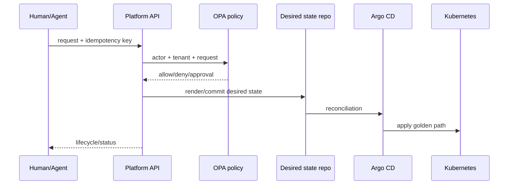

# Architecture

The control plane is a modular monolith because the first hard problem is governed workflow consistency, not service-to-service networking. It owns authorization, policy evaluation, idempotency, lifecycle state, audit events, planning, and GitOps rendering. Kubernetes is the data plane.

State is recorded as `REQUESTED → VALIDATING → PLANNED → APPLYING → READY`, with rejection, approval, failure, and destruction branches. The in-memory repository is intentionally local-demo only; PostgreSQL is the production persistence seam.
