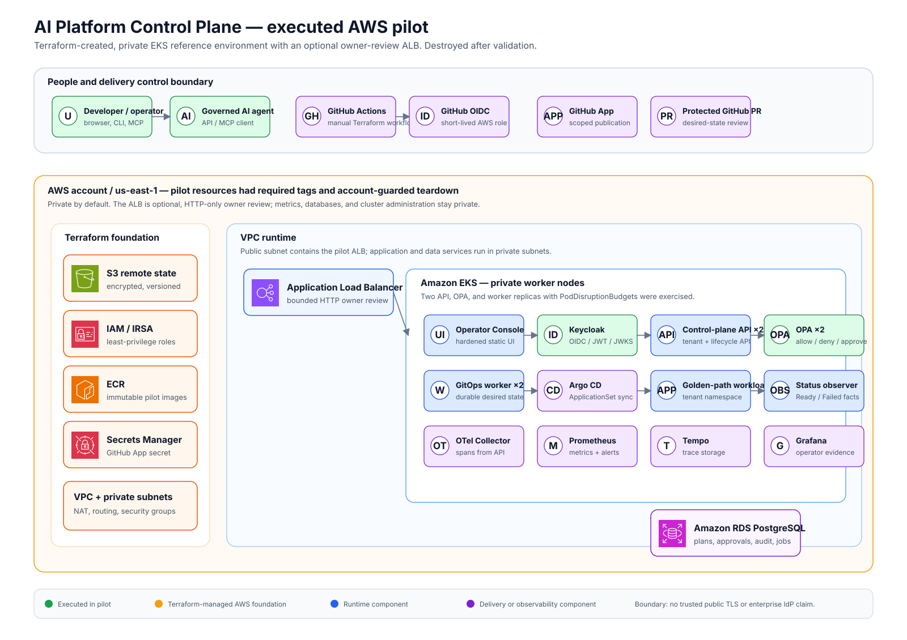
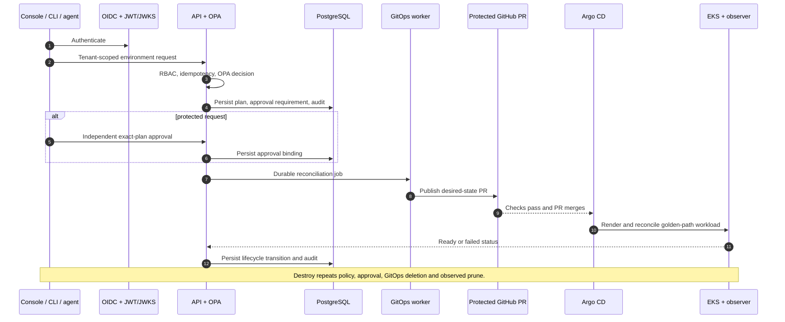

# Cloud Architecture

This is the deployed **single-account, private, ephemeral AWS reference architecture**. It was
created with Terraform, validated through governed GitOps lifecycle scenarios, and destroyed with
Terraform. It is the repository's primary architecture; the local harness is retained only for
fast developer verification.

## In plain English

Someone asks the platform for an environment instead of receiving powerful cloud credentials. The
platform checks who they are and what they are allowed to do, records a reviewable plan, and asks
for a separate approval when the change is sensitive. It then creates a GitHub change; Argo CD is
the component that applies that approved change to Kubernetes. The platform watches the result,
records what happened, and can safely remove the environment later.

## Executed AWS topology

This diagram uses selected official AWS Architecture Icons; the checked-in generator and attribution
are in [`docs/assets/`](assets/AWS_ICON_ATTRIBUTION.md). It is deliberately a topology, not a claim
that every line is a network connection. The rows inside EKS show the components that were deployed
together; the next section defines the governed lifecycle between them.

### What each area means

| Area | Responsibility | Pilot evidence |
| --- | --- | --- |
| People and delivery boundary | Developers, agents, GitHub review, and short-lived CI access initiate governed work. | GitHub-hosted OIDC apply and scoped GitHub App publication were executed. |
| Terraform foundation | State/lock guardrails, IAM/IRSA, ECR, Secrets Manager, VPC, and account tags create the bounded AWS foundation. | Terraform created and later removed the pilot footprint. |
| Private EKS runtime | The Console, Keycloak, API, OPA, worker, Argo, observer, workloads, and telemetry run without direct user cloud credentials. | GitOps lifecycle, failure/restore, Pod-loss recovery, traces, metrics, and alert drills were executed. |
| AWS ALB | The standard narrow browser path to the Console, API, and Keycloak only. | Executed with exact ALB OIDC/CORS origin; it is HTTP-only. |

## Governed environment lifecycle

## Trust boundaries

| Boundary | Enforced control |
| --- | --- |
| Browser/client → API | OIDC bearer token, JWT/JWKS validation, explicit CORS |
| API → write operation | tenant/RBAC, OPA, idempotency, immutable plan, approval where required |
| API → reconciliation | durable PostgreSQL job; API does not run cloud `kubectl`, Helm, or Terraform |
| Worker → GitHub | scoped GitHub App credential delivered through IRSA/External Secrets |
| GitHub → AWS | branch-bound GitHub OIDC role with short-lived credentials |
| Desired state → cluster | protected PR merge → Argo ApplicationSet; observed readiness/failure |
| Optional public review | version-pinned AWS Load Balancer Controller, exact ALB-origin OIDC redirect, HTTP listener only; no wildcard redirect or public observability endpoint |
