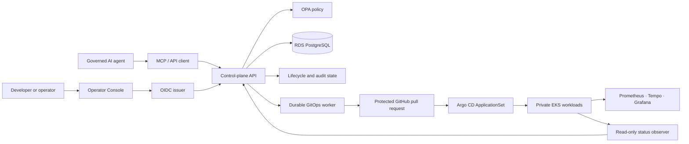
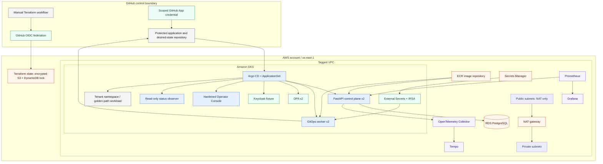
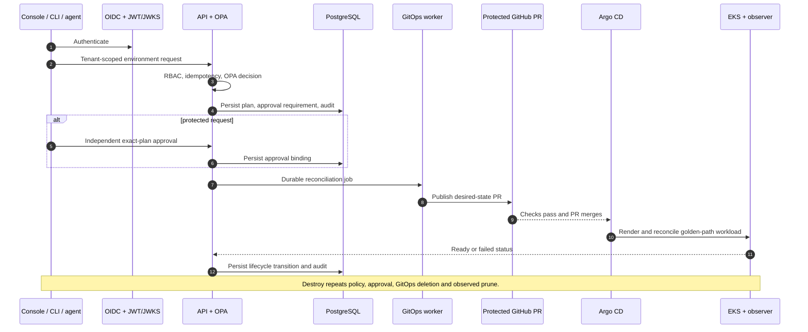

# Cloud Architecture

This is the deployed **single-account, private, ephemeral AWS reference architecture**. It was
created with Terraform, validated through governed GitOps lifecycle scenarios, and destroyed with
Terraform. It is the repository's primary architecture; the local harness is retained only for
fast developer verification.

## System context

## AWS deployment topology

## Governed environment lifecycle

## Trust boundaries

| Boundary | Enforced control |
| --- | --- |
| Browser/client → API | OIDC bearer token, JWT/JWKS validation, explicit CORS |
| API → write operation | tenant/RBAC, OPA, idempotency, immutable plan, approval where required |
| API → reconciliation | durable PostgreSQL job; API does not run cloud `kubectl`, Helm, or Terraform |
| Worker → GitHub | scoped GitHub App credential delivered through IRSA/External Secrets |
| GitHub → AWS | branch-bound GitHub OIDC role with short-lived credentials |
| Desired state → cluster | protected PR merge → Argo ApplicationSet; observed readiness/failure |
| Cloud review | temporary Cloudflare tunnel to local port-forwards only; no AWS public ingress |
